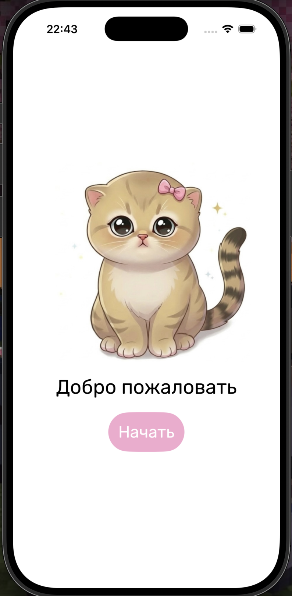
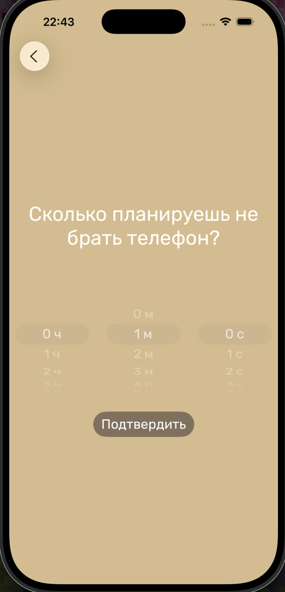
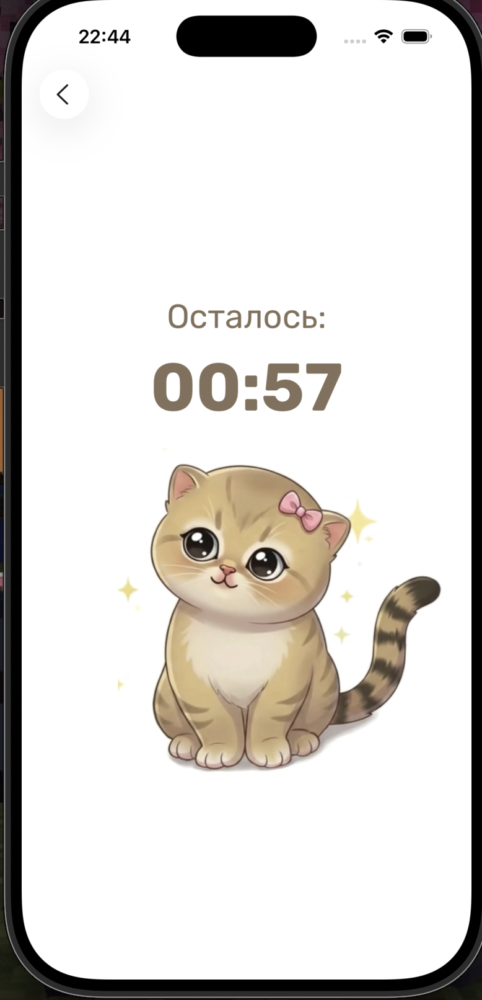
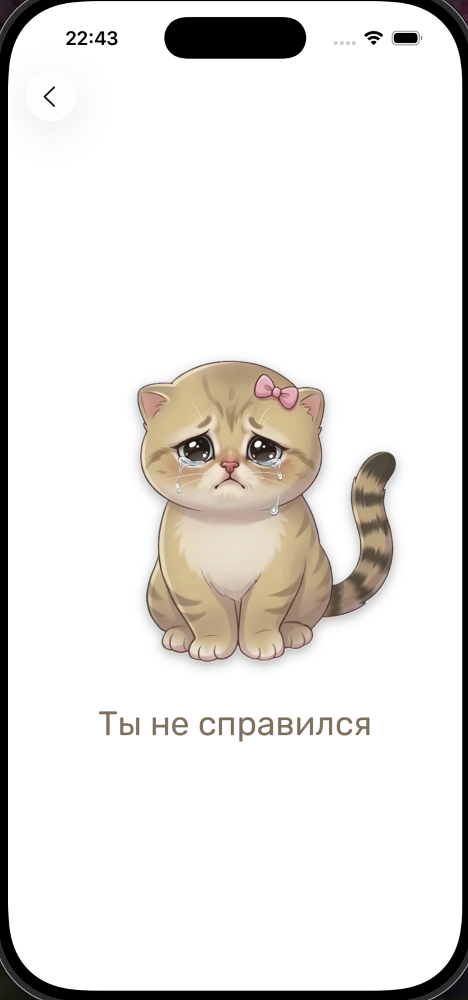
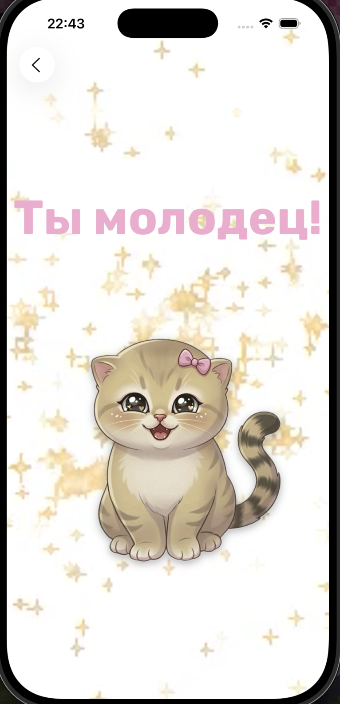

# TimeWellApp

## Идея проекта

TimeWellApp — это приложение, направленное на развитие самодисциплины и концентрации.

Основная идея:
> пользователь устанавливает время, в течение которого он не должен пользоваться телефоном

Если пользователь:
- выдерживает время → получает положительный результат  
- выходит из приложения раньше → попытка считается проваленной  

Такой подход имитирует реальные условия deep work и помогает формировать привычку фокусироваться.

---

## Структура проекта
```plaintext
TimeWellApp/
├── Views/
│   ├── MainView.swift              // основная логика таймера и состояния
│   ├── TimeSetting.swift           // экран выбора времени
│   ├── BackgroundVideoView.swift   // видео во время таймера
│   └── StarVideoView.swift         // видео при успехе
│
├── Extensions/
│   └── Font+Rubik.swift            // кастомные шрифты
│
├── Assets.xcassets/
│   ├── Colors/                     // customBrown, customPink, customBeige
│   ├── Images/                     // happyCat, cryCat, cat
│   └── Videos/                     // cat.mov, star.mov
│
└── TimeWellApp.swift               // entry point приложения
```
---

## Описание
TimeWellApp — это iOS-приложение на SwiftUI, которое помогает сфокусироваться и не отвлекаться на телефон в течение заданного времени.

---
## Первый экран



## Функциональность

### Установка времени



- Выбор часов, минут и секунд через Picker
- Блокировка кнопки, если время не выбрано

### Таймер



- Обратный отсчёт через Combine
- Обновление каждую секунду
- Форматирование времени (mm:ss / hh:mm:ss)

### Контроль выхода из приложения

- Отслеживание scenePhase
- Проверка ухода в background
- Исключение: блокировка экрана

### Провал



Если пользователь выходит из приложения:
- показывается экран с cryCat
- сообщение: "Ты не справился"

### Успех



Если таймер заканчивается:
- показывается экран с happyCat
- видео-фон
- сообщение: "Ты молодец!"

---

## Видео-фон
- AVPlayer + VideoPlayer
- зацикливание через NotificationCenter
- звук отключён
- экран не уходит в sleep

---

## Технические детали

### Используемые технологии
- SwiftUI
- Combine (Timer.publish)
- AVKit
- NotificationCenter
- ScenePhase

---

### Логика таймера
```swift 
.onReceive(timer) { _ in     if timeRemaining > 0 && !isCheated {         timeRemaining -= 1     } } 
```
---

### Детекция выхода из приложения
```swift 
.onChange(of: scenePhase) { _, newPhase in     if newPhase == .background {         if !isScreenLocked && timeRemaining > 0 {             isCheated = true         }     } } 
```

---

### Обработка блокировки экрана

```swift 
UIApplication.protectedDataWillBecomeUnavailableNotification UIApplication.protectedDataDidBecomeAvailableNotification 
```
Позволяет отличить:
- блокировку устройства  
- реальный выход из приложения  

---

## UI

### Цвета
- customBrown
- customPink
- customBeige

### Шрифты
```swift 
Font.rubikTitle(size:) Font.rubikBold(size:) 
```
---
 
